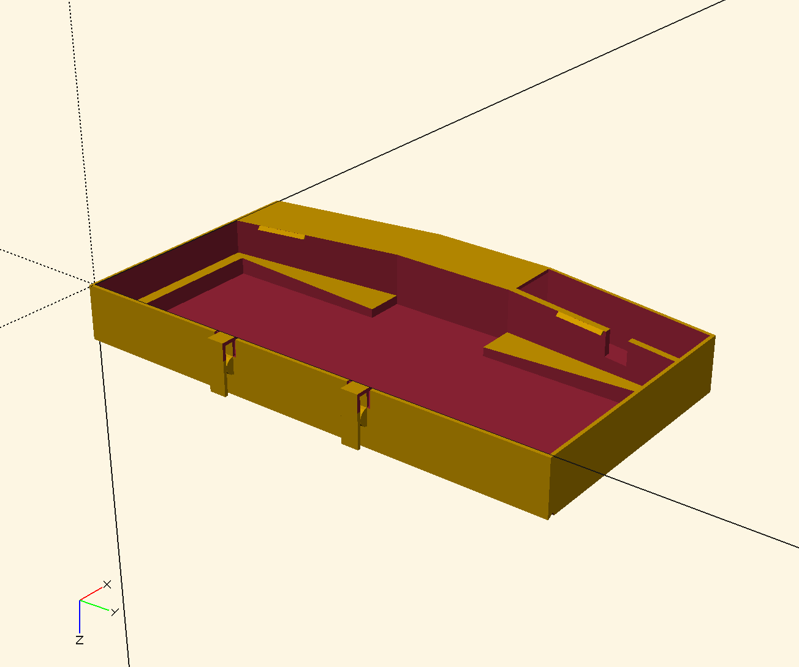

# WIP - WIP - WIP

My first project ever with OpenSCAD and first attempt at 3D printing as well.
This model hasn't been printed yet.

There are many different things to validate and try before considering using this for real:

- [ ] how thick do the cover needs to be?
- [ ] does the lockin system work?
- [ ] is the cable space enough? too big?
- [ ] are the measurment correct? (I just had a shitty ruller to measure my UHK...)

## progress

So far, I've got a model that starts to look like something

## Pieces count:

NOTE: somehow I screwed up the rendering at first so you'll need to apply the mirroring when generating models for the individual pieces else it's all gonna be on the wrong side...
I.e. you'll have a cable hole on the left side of your case instead of the right one.

- [ ] *medallion* **x1** (this is the part that's gonna be here for estetical reason to seal the two main parts together)
- [ ] *leftPart* **x1** (this parts contains the space to store the cable in)
- [ ] *rightPart* **x1** (this part contains the hole to let the cable go from your keyboard to the storing space on the other side)
- [ ] *topPart* **x1** (this should be called the bottom part really... it's gonna seal the storing space for the cable)
- [ ] *screws*
  - [ ] *short w/o depression (h = 4)* **x5** (these will keep the medallion in place, and seal the small joiners except 2 of them)
  - [ ] *short w/ depression (h = 4)* **x2** (these will be used for the joiner that are aligned with the middle of the case and offer a possible second lockin system via a strap or something like that)
  - [ ] *medium (h = 6)* **x2** (these will seal the larger joiners)
