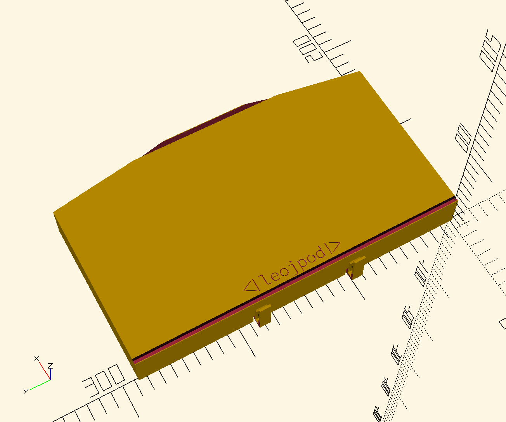

# WIP - WIP - WIP

My first project ever with OpenSCAD and first attempt at 3D printing as well.
This model hasn't been printed yet.

There are many different things to validate and try before considering using this for real:

- [ ] how thick do the cover needs to be?
- [ ] does the lockin system work?
- [ ] is the cable space enough? too big?
- [ ] are the measurment correct? (I just had a shitty ruller to measure my UHK...)

## progress

So far, I've got a model that starts to look like something

